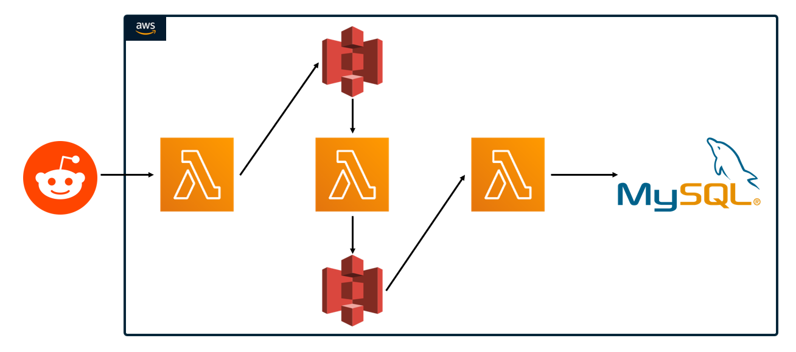

# Reddit Word Tracker
This project is a data pipeline built in AWS which analyzes the frequency of all words used on specific subreddits, in my case financial subreddits and stores them in a database which can be easily queried to determine which words are being used frequently on specific days and over time.
  
  
# The Architecture

A Lambda function trigered by a daily time based cloudwatch event is used to retrieve data from Reddit's public API and to write the retrieved data to an S3 bucket where it awaits processing. The creation of a log from the text data being stored in S3 triggers another Lambda function that reads the text data from S3 and cleans it, counts the number of occurnces of each word, and then creates a CSV file storing every word and the number times it was used in the past day. This CSV file is then uploaded to another S3 bucket for storage. The creation of a log from the CSV file being stored in S3 trigers a final Lambda function which reads the CSV file which was stored and writes each line of the file to a table in a MYSQL database. This table stores the word, the number of times it was used, and the date that the count was done on. For this table the primary key is the combination of the word and the date so that we can see the use of specific words over time.
  
    
# Future Improvements
In the future, I think a useful addition to the project would be replace the lambda function which cleans and analyzes the text data with a spark job executed on and EMR cluster. While with the current volume of data I am processing I dont think this is necessary, however if i were using a larger data source it would become more cost effective than processing it on the single EC2 instance that Lambda functions use.
